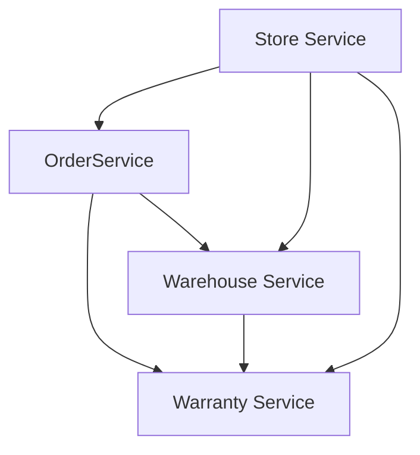

[](https://github.com/Romanow/store-service/actions/workflows/build.yml)
[](https://github.com/pre-commit/pre-commit)
[](https://github.com/Romanow/store-service/releases/latest)
[](https://hub.docker.com/r/romanowalex/store-service)
[](https://github.com/Romanow/store-service/blob/master/LICENSE)

# Store Service

GitHub: [romanow/store-service](https://github.com/Romanow/store-service).

## Состав

* [Store Service](store-service/README.md)
* [Order Service](order-service/README.md)
* [Warehouse Service](warehouse-service/README.md)
* [Warranty Service](warranty-service/README.md)

## Взаимодействие сервисов



## Сборка и запуск

Используем [docker-compose.yml](docker-compose.yml):

```shell
# build services
$ ./gradlew clean build

# build docker images
$ docker compose build

# run images
$ docker compose \
    -f docker-compose.yml \
    -f docker-compose.tracing.yml \
    -f docker-compose.logging.yml \
    -f docker-compose.monitoring.yml \
    up -d --wait
```
